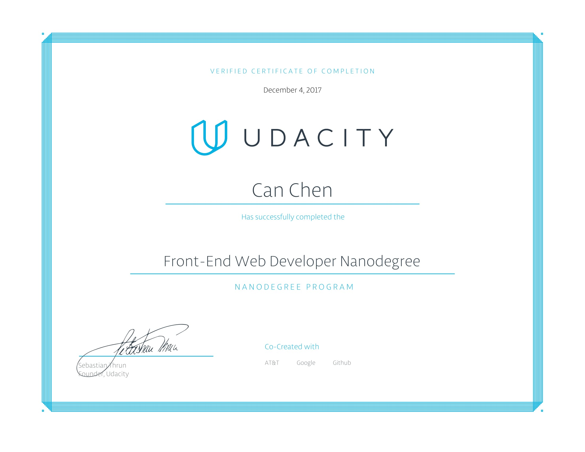
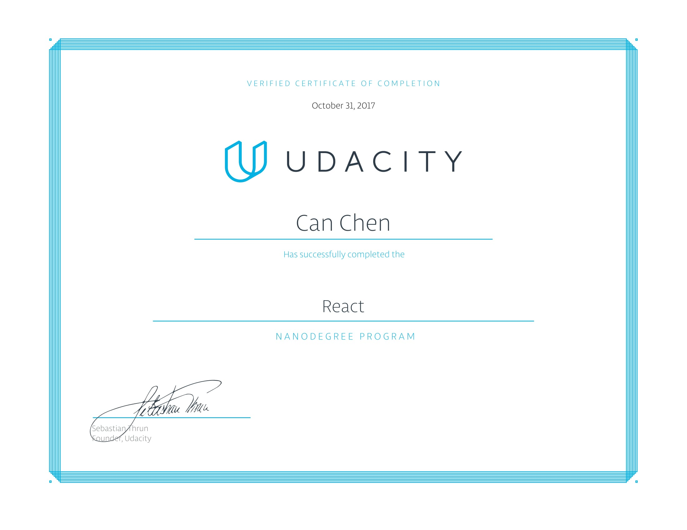
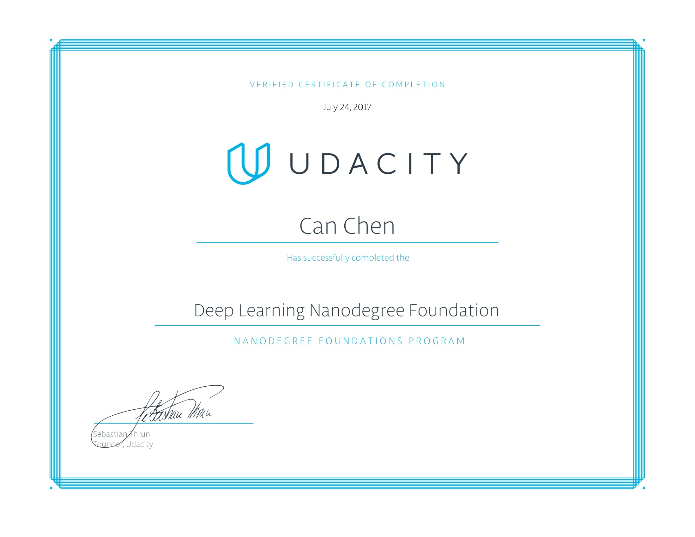

# Nav

One sentence introduction.

### Table of Contents
- [Projects](#Projects)
  - [Front-end](#Front-end)
    - Portfolio Website V3
    - Readable
    - My Fitness
    - My Reads
    - Neighborhood Map
    - Unit Testing
  - [Back-end](#Back-end)
  - [Mobile App](#Mobile-App)
    - Flash Cards
    - Android SPS
  - [Neural Network](#Neural-Network)
  - [Archived](#Archived)
- [Certificates](#Certificates)
  - [Front-end Web Developer Nanodegree](#nd001)
  - [React Nanodegree](#nd019)
  - [Deep Learning Fundation Nanodegree](#nd101)  

# Projects

One sentence introduction.

## Front-end

- Portfolio Website V3
- Portfolio Website V2
- Portfolio Website V1

- Readable
- My Fitness
- My Reads

- Neighborhood Map
- Unit Testing
- Pixel Art Maker

- Arcade Game Clone : Cross Road
- Arcade Game Clone : Flip Flop Match

- FEND-Portfolio
- FEND-Animal Trading Cards

## Back-end

## Mobile APP

- Flash Cards
- Android SPS

## Deep Learning Related

## Archived

- BlindZer
- My Icons

# Certificates

One sentence introduction.

## Front End Web Developer
6 month

## React
4 month

## Deep Learning Fundation
4 month

